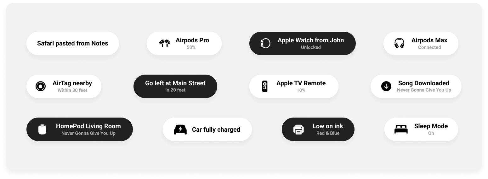

# Toast


A Swift Toast view - iOS 14 style - built with UIKit. 🍞



## Installation

### Swift Package Manager

[Toast](https://github.com/hengyu/Toast.git) could be installed via [Swift Package Manager](https://www.swift.org/package-manager/). Open Xcode and go to **File** -> **Add Packages...**, search `https://github.com/hengyu/Toast.git`, and add the package as one of your project's dependency.

### Manual

1. Download code from [GitHub](https://github.com/Hengyu/Toast);
2. Drag & drop the `Sources` folder into your project.

## Usage

To create a simple text based toast:
```swift
let toast = Toast.text("Safari pasted from Notes")
toast.show()
```

Or add a subtitle:
```swift
let toast = Toast.text("Safari pasted from Notes", subtitle: "A few seconds ago")
toast.show()
```

If you want to add an icon, use the `default` method to construct a toast:
```swift
let toast = Toast.default(
    image: UIImage(systemname: "airpodspro")!,
    title: "Airpods Pro",
    subtitle: "Connected"
)
toast.show()
```

Want to use a different layout, but still use the Apple style? Create your own view and inject it into the `AppleToastView` class when creating a custom toast:
```swift
let customView: UIView = // Custom view

let appleToastView = AppleToastView(child: customView)

let toast = Toast.custom(view: appleToastView)
toast.show()
```

The `show` method accepts several optional parameters. `haptic` of type `UINotificationFeedbackGenerator.FeedbackType` to use haptics and `after` of type `TimeInterval` to show the toast after a certain amount of time:
```swift
toast.show(haptic: .success, after: 1)
```

### Configuration options    
The `text`, `default` and `custom` methods support custom configuration options. The following options are available:

| Name            | Description                                                                                         | Type           | Default |
|-----------------|-----------------------------------------------------------------------------------------------------|----------------|---------|
| `autoHide`      | When set to true, the toast will automatically close itself after display time has elapsed.         | `Bool`         | `true`  |
| `enablePanToClose`      | When set to true, the toast will be able to close by swiping up.         | `Bool`         | `true`  |
| `displayTime`   | The duration the toast will be displayed before it will close when autoHide set to true in seconds. | `TimeInterval` | `4`     |
| `animationTime` | Duration of the show and close animation in seconds.                                                | `TimeInterval` | `0.2`   |
| `attachTo`      | The view which the toast view will be attached to.                                                  | `UIView`       | `nil`   |


```swift
let configuration = ToastConfiguration(
    autoHide: true,
    enablePanToClose: true,
    displayTime: 5,
    animationTime: 0.2
)

let toast = toast.text("Safari pasted from Notes", configuration: configuration)
```

### Custom toast view

Don't like the default Apple'ish style? No problem, it is also possible to use a custom toast view with the `custom` method. Firstly, create a class that confirms to the `ToastView` protocol:
```swift
class CustomToastView : UIView, ToastView {
    private let text: String

    public init(text: String) {
        self.text = text
    }

    func createView(for toast: Toast) {
        // View is added to superview, create and style layout and add constraints
    }
}
```

Use your custom view with the `custom` construct method on `Toast`:
```swift
let customToastView: ToastView = CustomToastView(text: "Safari pasted from Notes")

let toast = Toast.custom(view: customToastView)
toast.show()
```

### Delegates

Below delegate functions are optional to implement when implementing `ToastDelegate`.

```swift
extension MyViewController: ToastDelegate {
    func willShowToast(_ toast: Toast) {
        print("Toast will be shown after this")
    }

    func didShowToast(_ toast: Toast) {
        print("Toast was shown")
    }

    func willCloseToast(_ toast: Toast) {
        print("Toast will be closed after this")
    }

    func didCloseToast(_ toast: Toast) {
        print("Toast was closed (either automatically, dismissed by user or programmatically)")
    }
}
```

## Licence

[Toast](https://github.com/Hengyu/Toast) is released under the [MIT License](LICENSE).

## Acknowledgements

[Toast](https://github.com/Hengyu/Toast) is origniated from the [toast-swift](https://github.com/BastiaanJansen/toast-swift) by [Bastiaan Jansen](https://github.com/BastiaanJansen).
